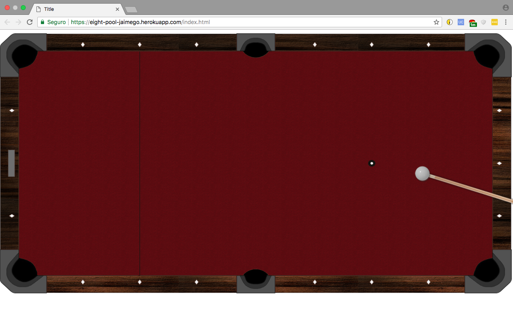
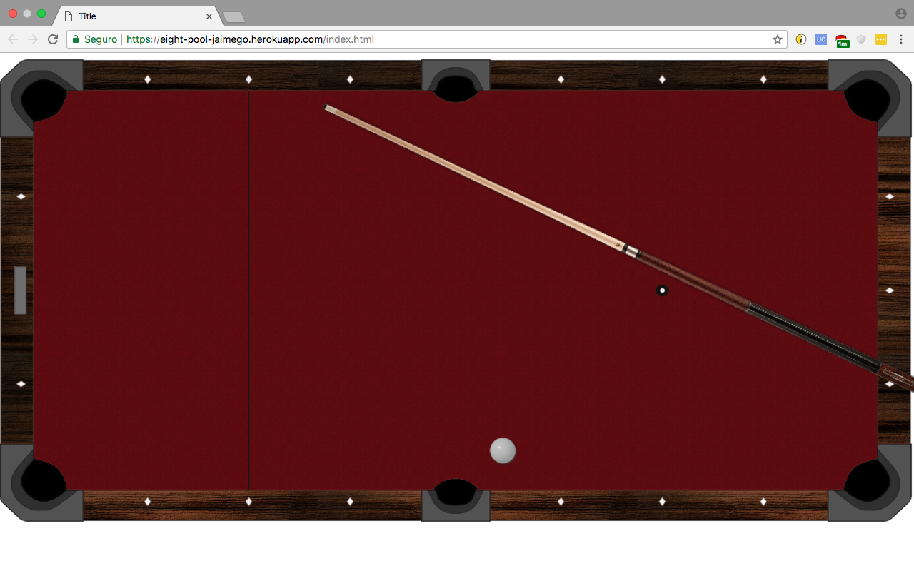

# eight-pool

Pool game created in Javascript and Html5, for educational purposes. Based on this video: https://www.youtube.com/watch?v=aXwCrtAo4Wc

The stick is relocated when the ball stops moving. If the ball goes in a hole, it is relocated to the initial spot.

It uses only one ball, as most of the structure of the game is developed at this point and adding collisions would take only time, without adding much complexity. 

It was fun!

Play eight-pool in Heroku: https://eight-pool-jaimego.herokuapp.com/

